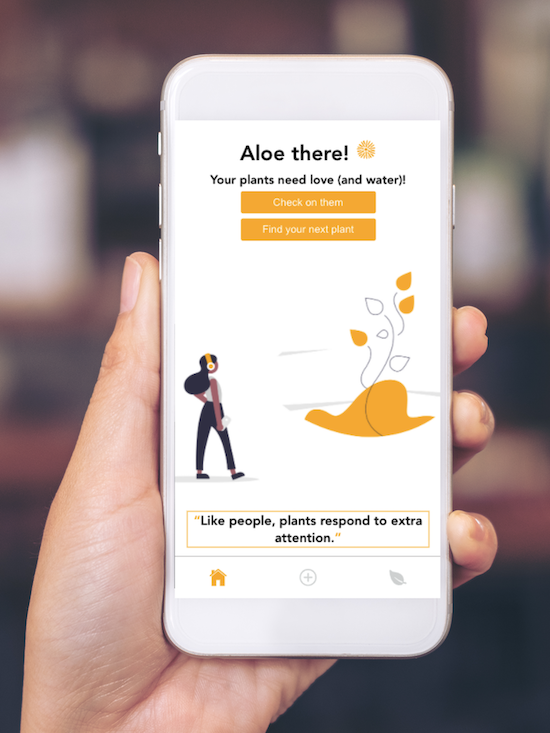
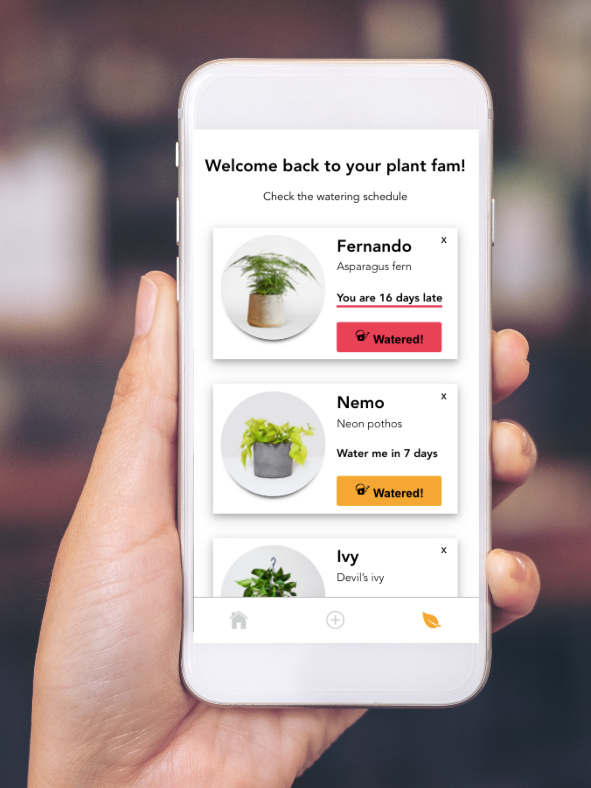

# Aloe there! 👋🌿

## What is it

A plant care progressive web app, for expert plant lovers and newbies alike.

With a short quiz, it finds the perfect plant match for your environment and requirements, provides watering instructions and sets watering reminders with push notifications.

Aloe there comes in two colour schemes, visually flagging when your plants need watering.
Checkout the <a href="client/src/assets/mobile-homepage-green.png">homepage screen</a> and the <a href="client/src/assets/mobile-myplants-green.png">schedule screen</a> when all your plants are watered and happy.

## Tech stack

The app runs on an Express server, with a MongoDB (/Mongoose) database. On the frontend, it's built in React, with a mobile-first design. Assets courtesy of undraw.

## Getting started

You can find default settings to run the server and mongoDB in the index.js files.
You can start the server with npm run start script, same for the client.
